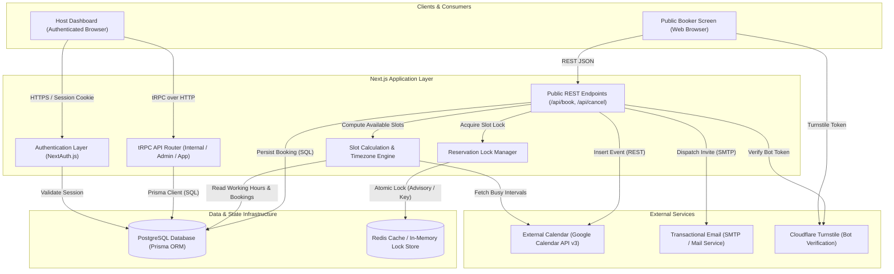

# Architecture Specification — Cal.diy Rebuild

## 1. System Overview & Component Diagram

The Cal.diy Rebuild is designed as a focused, modular Next.js application backed by a PostgreSQL database and an optional Redis cache for concurrency control. It strips away legacy multi-tenant enterprise modules in favor of a clean, single-tenant or personal multi-user architecture prioritizing security, concurrency safety, and performance.

---

## 2. Component Descriptions & Interactions

### Client Layer
- **Host Dashboard**: Authenticated interface where hosts manage their weekly availability schedules, configure event types, view paginated booking histories, and manage connected calendar credentials.
- **Public Booker Screen**: Responsive client-side interface where invitees select time slots, convert times across timezones, fill in required booking details, and submit appointment reservations.

### Application Layer
- **NextAuth.js Session Layer**: Manages session cookies, password validation, and OAuth token exchanges.
- **tRPC API Router**: Provides type-safe internal procedures for authenticated user actions (schedule creation, event type editing, booking modifications).
- **Public API Endpoints**:
  - `/api/book/event`: Public appointment reservation handler with bot token verification, composite rate limiting, atomic concurrency locking, and database persistence.
  - `/api/cancel`: Secure cancellation endpoint requiring either an authenticated host session or a cryptographically signed HMAC token issued to the attendee.
- **Slot Calculation Engine**: Aggregates weekly availability hours, date overrides, and busy calendar intervals from both local database records and external calendar feeds, projecting available windows into the invitee's target timezone.
- **Reservation Lock Manager**: Orchestrates atomic slot reservations using database advisory locks or Redis keys to guarantee zero double bookings during concurrent booking submissions.

---

## 3. External Services

1. **Google Calendar API v3**:
   - *Protocol*: OAuth 2.0 and REST JSON.
   - *Purpose*: Reads busy times from host calendars during slot computation and creates confirmed event records with conference links upon booking completion.
2. **Transactional Email Transport (SMTP / Resend)**:
   - *Protocol*: SMTP / REST API.
   - *Purpose*: Sends booking confirmation notices, ICS calendar attachments, and secure HMAC-signed cancellation links to hosts and attendees.
3. **Cloudflare Turnstile**:
   - *Protocol*: HTTPS REST API.
   - *Purpose*: Evaluates client bot challenge tokens on public booking submission forms prior to processing reservation requests.

---

## 4. Where State Lives

| State Category | Storage Location | Specific Mechanism & Content |
|---|---|---|
| **Persistent Data** | PostgreSQL Database | Core entity records including Users, Schedules, Availability intervals, Event Types, Bookings, Attendees, and OAuth Credentials. |
| **Concurrency Locks** | Redis / PostgreSQL Advisory Locks | Distributed reservation mutexes keyed on `(hostId, startTime, endTime)` with short TTLs (10–30s) during booking submission. |
| **Session State** | Encrypted Cookies / Server Memory | Signed JWT session tokens (`next-auth.session-token`) managed by NextAuth, holding user ID, email, and role. |
| **Client UI State** | Browser Local Storage & Memory | Active theme preferences (`next-themes`), temporary form inputs, and atomic reactive UI state (Jotai). |
| **Static & Build Caches** | Server Filesystem | Precompiled Next.js assets (`.next/`), cached Turborepo outputs (`.turbo/`), and compiled Lucide SVG sprite sheets. |

---

## 5. Key Decisions and Rationale

### Decision 1: Purge Legacy Enterprise Database Models
- *Action*: Completely remove dead models (`Team`, `Membership`, `DSyncData`, `BookingDenormalized`, `CalendarCache`) from the Prisma schema.
- *Rationale*: Verified observations proved these models are dead artifacts that create migration overhead, obscure the single-user domain model, and contradict the documentation. Removing them creates a clean, reviewable schema.

### Decision 2: Implement Atomic Concurrency Locking on Booking Persistence
- *Action*: Wrap slot validation and insertion in an explicit reservation lock (PostgreSQL advisory lock or transactional constraint) prior to executing external calendar calls.
- *Rationale*: Verified observations revealed that the original architecture checks availability and creates bookings in separate asynchronous steps separated by hundreds of lines of code. An atomic reservation lock permanently prevents overlapping double bookings.

### Decision 3: Enforce Cryptographic Token Verification on Booking Cancellation
- *Action*: Secure the `/api/cancel` route by requiring either an authenticated host session or an HMAC-SHA256 signature generated over `(bookingUid, bookingCreatedAt, serverSecret)` sent in the confirmation email.
- *Rationale*: Verified observations identified a critical Broken Object-Level Authorization (BOLA) vulnerability where any caller possessing a booking UID could cancel appointments. Requiring signed tokens prevents unauthorized external cancellations while preserving passwordless attendee workflows.

### Decision 4: Mandatory Bot Protection & Composite Rate Limiting
- *Action*: Enable Turnstile verification by default on public booking forms, and derive rate-limiting keys from a combination of client IP, target event type ID, and booker email.
- *Rationale*: Verified observations showed that Turnstile was gated behind an optional flag and rate limiting relied solely on client IP, leaving booking endpoints vulnerable to automated slot exhaustion attacks via proxy rotation.
