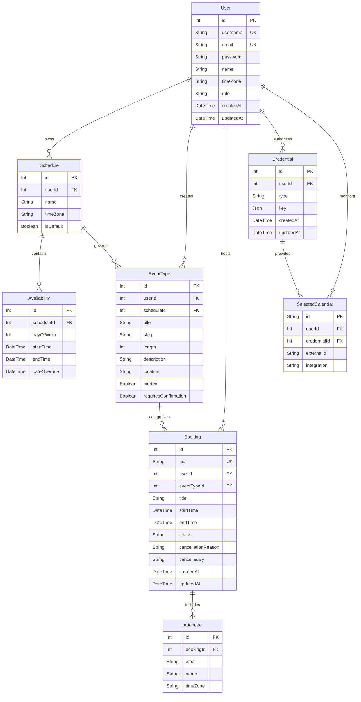

# Data Model Specification — Cal.diy Rebuild

## 1. Entity-Relationship Diagram

The rebuilt data model focuses entirely on core single-user and small-team scheduling primitives. It deliberately eliminates dead enterprise artifacts (`Team`, `Membership`, `DSyncData`, `BookingDenormalized`, `CalendarCache`, `Deployment.licenseKey`).

---

## 2. Entity Definitions & Field Details

### 1. `User`
- **Purpose**: Represents registered calendar owners and administrators.
- **Fields**:
  - `id` (`Int`, Primary Key, Auto-increment): Unique identifier for the user.
  - `username` (`String`, Unique, Indexed): Public handle used in booking URLs (`/[username]/[slug]`).
  - `email` (`String`, Unique, Indexed): User's primary email address used for login and notifications.
  - `password` (`String`, Nullable): Hashed password string for local credentials authentication.
  - `name` (`String`, Nullable): Display name presented to booking invitees.
  - `timeZone` (`String`, Default `"UTC"`): Primary IANA timezone string for the user.
  - `role` (`Enum ["USER", "ADMIN"]`, Default `"USER"`): System permission role.
  - `createdAt` (`DateTime`, Default `now()`): Account creation timestamp.
  - `updatedAt` (`DateTime`, Updated on modification): Timestamp of last account update.
- **Relations**:
  - `schedules`: One-to-many relationship with `Schedule` (cascade delete).
  - `eventTypes`: One-to-many relationship with `EventType` (cascade delete).
  - `bookings`: One-to-many relationship with `Booking` (cascade delete).
  - `credentials`: One-to-many relationship with `Credential` (cascade delete).
- **Constraints & Indexes**:
  - Unique: `[email]`, `[username]`
  - Index: `[role]`

---

### 2. `Schedule`
- **Purpose**: Defines weekly availability profiles and working hours.
- **Fields**:
  - `id` (`Int`, Primary Key, Auto-increment): Unique identifier for the schedule.
  - `userId` (`Int`, Foreign Key referencing `User.id`): Owner of the schedule.
  - `name` (`String`): Descriptive schedule title (e.g., "Standard Working Hours").
  - `timeZone` (`String`, Nullable): Schedule-specific timezone override.
  - `isDefault` (`Boolean`, Default `false`): Designates the fallback schedule for new event types.
- **Relations**:
  - `user`: Many-to-one relationship with `User`.
  - `availability`: One-to-many relationship with `Availability` (cascade delete).
  - `eventTypes`: One-to-many relationship with `EventType`.
- **Constraints & Indexes**:
  - Index: `[userId]`

---

### 3. `Availability`
- **Purpose**: Specific time windows during which the user is open for appointments.
- **Fields**:
  - `id` (`Int`, Primary Key, Auto-increment): Unique identifier.
  - `scheduleId` (`Int`, Foreign Key referencing `Schedule.id`): Parent schedule container.
  - `dayOfWeek` (`Int`): Day of the week represented as 0 (Sunday) through 6 (Saturday).
  - `startTime` (`DateTime`, Time format `HH:mm`): Beginning of the availability window.
  - `endTime` (`DateTime`, Time format `HH:mm`): End of the availability window.
  - `dateOverride` (`DateTime`, Nullable, Date only): Optional specific calendar date for one-off availability adjustments.
- **Relations**:
  - `schedule`: Many-to-one relationship with `Schedule`.
- **Constraints & Indexes**:
  - Index: `[scheduleId]`, `[dayOfWeek]`, `[dateOverride]`

---

### 4. `EventType`
- **Purpose**: Configurable meeting templates offered to the public.
- **Fields**:
  - `id` (`Int`, Primary Key, Auto-increment): Unique identifier.
  - `userId` (`Int`, Foreign Key referencing `User.id`): Host owner.
  - `scheduleId` (`Int`, Foreign Key referencing `Schedule.id`): Schedule governing available slots.
  - `title` (`String`): Public title of the event (e.g., "15 Min Catchup").
  - `slug` (`String`): URL identifier used in the route path (`/[username]/[slug]`).
  - `length` (`Int`): Duration of the appointment in minutes.
  - `description` (`String`, Nullable): Rich markdown or plain text meeting description.
  - `location` (`String`, Default `"integrations:google:meet"`): Meeting destination.
  - `hidden` (`Boolean`, Default `false`): Hides event from the host's public index page.
  - `requiresConfirmation` (`Boolean`, Default `false`): Requires manual host acceptance before confirmation.
- **Relations**:
  - `user`: Many-to-one relationship with `User`.
  - `schedule`: Many-to-one relationship with `Schedule`.
  - `bookings`: One-to-many relationship with `Booking`.
- **Constraints & Indexes**:
  - Unique Composite: `[userId, slug]`
  - Index: `[userId]`, `[scheduleId]`

---

### 5. `Booking`
- **Purpose**: Concrete booked appointment between a host and one or more attendees.
- **Fields**:
  - `id` (`Int`, Primary Key, Auto-increment): Internal integer identifier.
  - `uid` (`String`, Unique, High Entropy): Random unguessable UUID used for public references and links.
  - `userId` (`Int`, Foreign Key referencing `User.id`): Host organizer.
  - `eventTypeId` (`Int`, Foreign Key referencing `EventType.id`): Category template.
  - `title` (`String`): Meeting summary string.
  - `startTime` (`DateTime`): Scheduled start timestamp in UTC.
  - `endTime` (`DateTime`): Scheduled end timestamp in UTC.
  - `status` (`Enum ["ACCEPTED", "CANCELLED", "PENDING"]`, Default `"ACCEPTED"`): Booking state.
  - `cancellationReason` (`String`, Nullable): Reason provided upon cancellation.
  - `cancelledBy` (`String`, Nullable): Email or identity of party who initiated cancellation.
  - `createdAt` (`DateTime`, Default `now()`): Creation timestamp.
  - `updatedAt` (`DateTime`, Updated on modification): Last update timestamp.
- **Relations**:
  - `user`: Many-to-one relationship with `User`.
  - `eventType`: Many-to-one relationship with `EventType`.
  - `attendees`: One-to-many relationship with `Attendee` (cascade delete).
- **Constraints & Indexes**:
  - Unique: `[uid]`
  - Exclusion / Transactional Lock: `(userId, startTime, endTime) WHERE status != 'CANCELLED'`
  - Index: `[userId, status, startTime]`, `[startTime, endTime, status]`, `[eventTypeId]`

---

### 6. `Attendee`
- **Purpose**: External invitee participant associated with a booking.
- **Fields**:
  - `id` (`Int`, Primary Key, Auto-increment): Unique identifier.
  - `bookingId` (`Int`, Foreign Key referencing `Booking.id`): Parent booking.
  - `email` (`String`, Indexed): Invitee email address for invites and notifications.
  - `name` (`String`): Invitee display name.
  - `timeZone` (`String`): Invitee's local timezone.
- **Relations**:
  - `booking`: Many-to-one relationship with `Booking`.
- **Constraints & Indexes**:
  - Index: `[bookingId]`, `[email]`

---

### 7. `Credential` & `SelectedCalendar`
- **Purpose**: Stores external integration tokens (such as Google Calendar OAuth refresh tokens) and indicates which connected calendar channels to monitor for busy times.
- **Fields (`Credential`)**:
  - `id` (`Int`, Primary Key, Auto-increment)
  - `userId` (`Int`, Foreign Key referencing `User.id`)
  - `type` (`String`): Provider identifier (e.g., `"google_calendar"`).
  - `key` (`Json`): Encrypted OAuth tokens and scopes.
- **Fields (`SelectedCalendar`)**:
  - `id` (`String`, Primary Key, UUID)
  - `userId` (`Int`, Foreign Key referencing `User.id`)
  - `credentialId` (`Int`, Foreign Key referencing `Credential.id`)
  - `externalId` (`String`): External calendar ID (e.g., primary calendar email).
  - `integration` (`String`): Provider string.
- **Constraints & Indexes**:
  - Index: `Credential[userId]`, `SelectedCalendar[userId]`, `SelectedCalendar[credentialId]`
